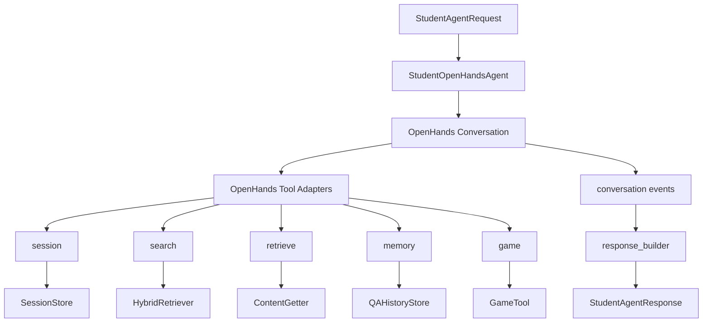

# ChaoXingAgent

> 🚀 **部署到服务器**：详见 [`DEPLOYMENT.md`](./DEPLOYMENT.md)（基于 `uv` 的 Linux 服务器部署清单）。
> 🛠️ **Windows 本地一键启动**：双击 [`start.bat`](./start.bat)，默认后端 `http://127.0.0.1:8001`、前端 `http://127.0.0.1:3000`；停止服务用 [`stop.bat`](./stop.bat)。
> 🧪 **运行测试**：`uv run pytest tests/api/`，详见 `tests/api/README.md`、`tests/mysql/README.md`、`tests/e2e/README.md`。

## 项目概览

本项目当前包含两条主要链路：

- 教师侧课件处理与生成链路
- 学生侧基于 OpenHands 的教学 Agent 链路

当前 student 链路已经具备以下能力：

- 可以实际运行
- 可以接入真实 LLM
- 可以通过 OpenHands 调用工具
- 可以返回结构化 `StudentAgentResponse`
- 可以在特定场景下触发互动游戏工具 `game`

student 链路不是普通聊天机器人，而是一个面向课程内容、带学习状态、带工具调用能力的教学 Agent。

它会消费：

- 教师侧产出的 `structured_content`
- 可选的 `lesson_script`
- 当前 `session`
- 当前 `progress`
- 可选的 `history_qa`

最终产出：

- `answer`
- `references`
- `next_action`
- `updated_session`
- `updated_progress`
- `qa_record`

## 目录结构

核心目录：

- [src](src/) — FastAPI 后端、Agent、服务和工作流
- [frontend](frontend/) — Vue 3 + Vite 前端
- [docs](docs/) — API、安装和集成文档
- [Dev_docs](Dev_docs/) — 早期并行开发契约和任务边界
- [scripts](scripts/) — 辅助脚本
- [tests](tests/) — 自动化测试

student 链路最关键的文件：

- 对外入口：
  - [src/agents/student/__init__.py](src/agents/student/__init__.py)
- student 主入口：
  - [src/agents/student/agent.py](src/agents/student/agent.py)
- 响应收口层：
  - [src/agents/student/response_builder.py](src/agents/student/response_builder.py)
- 请求/响应 schema：
  - [src/schemas/student_schemas.py](src/schemas/student_schemas.py)
- 业务工具层：
  - [src/tools/search.py](src/tools/search.py)
  - [src/tools/retrieve.py](src/tools/retrieve.py)
  - [src/tools/session.py](src/tools/session.py)
  - [src/tools/memory.py](src/tools/memory.py)
  - [src/tools/game.py](src/tools/game.py)
- OpenHands 工具适配层：
  - [src/tools/openhands/search_tool.py](src/tools/openhands/search_tool.py)
  - [src/tools/openhands/retrieve_tool.py](src/tools/openhands/retrieve_tool.py)
  - [src/tools/openhands/session_tool.py](src/tools/openhands/session_tool.py)
  - [src/tools/openhands/memory_tool.py](src/tools/openhands/memory_tool.py)
  - [src/tools/openhands/game_tool.py](src/tools/openhands/game_tool.py)

## Student 链路架构



## Student 链路内部机制

student 主链路位于：

- [src/agents/student/agent.py](src/agents/student/agent.py)

当前运行机制如下：

1. 校验 `StudentAgentRequest`
2. 为本轮对话创建临时 `session/history store`
3. 初始化 `StudentOpenHandsAgent`
4. 注册 OpenHands 工具：
   - `search`
   - `retrieve`
   - `session`
   - `memory`
   - `game`
5. 启动 OpenHands `Conversation`
6. 如果传入真实 LLM：
   - 优先让 OpenHands 基类 `Agent.step()` 驱动 tool loop
   - 从 conversation events 中提取工具结果和最终消息
7. 如果没有真实 LLM，或者本轮没有产生可用的工具/消息结果：
   - 回退到 grounded fallback 路径
8. 组装 `qa_output`
9. 组装 `decision_output`
10. 由 `response_builder` 生成最终 `StudentAgentResponse`
11. 持久化本轮的 session/history 快照

另外，当前实现已经补了一个重要兜底：

- 即使 OpenHands 因达到最大迭代数而没有优雅 `FINISHED`
- student 主入口也会做最终收口
- 不会直接返回空 answer / 空 decision / 空 tool trace

## Game Tool 说明

### 当前定位

`game` 是 student agent 的第 5 个工具，不是前端单独调用的小游戏模块。

当前第一版只实现了一种模式：

- `multiple_choice`

对应文件：

- 业务工具：[src/tools/game.py](src/tools/game.py)
- OpenHands 适配：[src/tools/openhands/game_tool.py](src/tools/openhands/game_tool.py)

### 触发逻辑

当前游戏主要由 LLM 决策触发：

- 当 LLM 在决策阶段给出 `next_action = "trigger_game"`
- agent 会调用 `game` tool
- `game` tool 会基于当前 lesson context 生成一道选择题

当前规则层不会主动强行触发游戏，它只负责兜底。

另外系统还做了补救：

- 如果 LLM 决策为 `trigger_game`
- 但没有真的调用 `game` tool`
- agent 会在收口阶段补调一次 `game`

所以不会出现“决策要求出题，但最终没有题”的情况。

### 输出内容

当触发游戏时，最终会出现三层输出：

1. `answer`
   - 直接给学生展示的题面和选项

2. `metadata["game"]`
   - 结构化题目数据，推荐前后端优先消费这一层

3. `tool_trace`
   - 保留 `game` 工具调用记录，便于调试和审计

`metadata["game"]` 当前结构大致为：

```json
{
  "game_type": "multiple_choice",
  "prompt": "关于“应力”，下列哪一项最符合本课时内容？",
  "choices": [
    "...",
    "...",
    "...",
    "..."
  ],
  "correct_index": 0,
  "correct_choice": "...",
  "explanation": "...",
  "references": [...]
}
```

### 前后端消费建议

推荐前端/后端这样处理：

- 展示层：
  - 优先使用 `answer`
- 结构化交互层：
  - 优先使用 `metadata["game"]`
- 调试排障：
  - 查看 `tool_trace`

### 当前已知限制

- 当前只支持单题选择题
- 题目基于当前 lesson context 现生成，不是独立题库
- 未来可继续扩展：
  - 判断题
  - 填空题
  - 配对题
  - 多轮互动游戏

## Real Agent 与 Fallback 的区别

当前 student 链路支持两种运行模式。

### Fallback 模式

出现条件：

- 没有传真实 LLM
- 或使用的是 placeholder LLM

特征：

- OpenHands 框架仍会运行
- 但 `answer / decision` 会回落到本地保底逻辑

### Real Agent 模式

出现条件：

- 传入真实 LLM

特征：

- OpenHands tool loop 生效
- `answer` 由真实 LLM 路径产出
- `decision` 由真实 LLM 路径产出
- 可以触发 `game` tool

判断方式：

- `qa_output["answer_source"]`
- `decision_output["decision_source"]`

解释：

- `llm_agent`：真实 LLM Agent 路径
- `fallback_rule`：保底路径

## Student 正式入口

对外 API：

- `build_student_agent_turn(request, llm=None) -> dict`
- `run_student_agent(request, llm=None) -> dict`

位置：

- [src/agents/student/__init__.py](src/agents/student/__init__.py)
- [src/agents/student/agent.py](src/agents/student/agent.py)

推荐使用方式：

- 调试和排障：用 `build_student_agent_turn(...)`
- 正式对外返回：用 `run_student_agent(...)`

## 环境变量配置

当前 `.env` 里用到的主要字段：

- `LLM_PROVIDER`
- `LLM_API_KEY`
- `LLM_BASE_URL`
- `LLM_MODEL`
- `LLM_CHAT_COMPLETIONS_PATH`
- `LLM_TIMEOUT_SECONDS`
- `LLM_TEMPERATURE`
- `LLM_MAX_TOKENS`

当前示例：

```env
LLM_PROVIDER=deepseek
LLM_API_KEY=...
LLM_BASE_URL=https://api.deepseek.com
LLM_MODEL=deepseek-chat
```

为了兼容 OpenHands / LiteLLM，运行时实际会转成：

```text
deepseek/deepseek-chat
```

## 快速运行

直接运行：

```powershell
python scripts\run_student_agent.py
```

参考脚本：

- [scripts/run_student_agent.py](scripts/run_student_agent.py)

这个脚本会：

- 读取 `.env`
- 构造真实 OpenHands `LLM`
- 构造一份最小 demo `StudentAgentRequest`
- 运行 student agent
- 打印：
  - `tool_trace`
  - `qa_output`
  - `decision_output`
  - 最终 response

### 交互式演示脚本

新增交互式脚本：

- [scripts/student_agent_demo_cli.py](scripts/student_agent_demo_cli.py)

用途：

- 和 agent 多轮对话
- 展示 tool trace、decision、状态变化
- 演示 `game` tool 的触发与输出
- 支持内置 mock 数据
- 支持读取外部 `structured_content.json / lesson_script.json`

运行内置 mock：

```powershell
python scripts\student_agent_demo_cli.py
```

运行现成 artifact mock：

```powershell
python scripts\student_agent_demo_cli.py --artifact-dir docs\artifact_mock\student_mock\manual_generate_agent_20260316_152851
```

支持的主要命令：

- `/lesson`
- `/state`
- `/history`
- `/trace`
- `/demo`
- `/preview-game`
- `/reset`
- `/quit`

## 后端接入

后端接入文档见：

- [docs/student_backend_integration.md](docs/student_backend_integration.md)

后端需要重点知道：

- 调哪个函数
- 请求结构长什么样
- 真实 LLM 怎么传
- 响应里哪些字段要落库、哪些字段给前端
- 如果触发游戏，如何消费 `metadata["game"]`

## 后端接入示例

```python
from pydantic import SecretStr
from openhands.sdk.llm import LLM

from src.agents.student import run_student_agent
from src.schemas import StudentAgentRequest

request = StudentAgentRequest.model_validate(request_payload)

llm = LLM(
    model="deepseek/deepseek-chat",
    api_key=SecretStr("YOUR_LLM_API_KEY"),
    base_url="https://api.deepseek.com",
    litellm_extra_body={},
)

result = run_student_agent(request, llm=llm)
```

## 测试

student 相关关键测试：

- [tests/student/integration/test_student_agent.py](tests/student/integration/test_student_agent.py)
- [tests/student/test_openhands_tools.py](tests/student/test_openhands_tools.py)
- [tests/student/test_openhands_student_flow.py](tests/student/test_openhands_student_flow.py)
- [tests/student/test_response_builder.py](tests/student/test_response_builder.py)
- [tests/student/test_tools_game.py](tests/student/test_tools_game.py)

常用命令：

```powershell
pytest tests\student\integration\test_student_agent.py -q
pytest tests\student\test_openhands_tools.py tests\student\test_openhands_student_flow.py tests\student\test_response_builder.py -q
pytest tests\student\test_tools_game.py -q
```

## 当前已知事项

1. student 链路已经能在真实模型下运行。
2. 不同 Python 环境里的 OpenHands 版本存在差异。
   student 自定义 Agent 已兼容 `on_token` 差异。
3. 当前支持内置 mock 和外部 artifact mock。
4. `game` 目前只是一题选择题，不是完整题库系统。
5. prompt policy 和 tool-choice 稳定性仍可继续优化。
6. 某些终端环境下中文显示可能受编码影响，但文件本身应以 UTF-8 保存。

## 其他架构文档

项目架构与交付文档：

- [Dev_docs/PROJECT_BRIEF.md](Dev_docs/PROJECT_BRIEF.md)
- [Dev_docs/FLOW.md](Dev_docs/FLOW.md)
- [Dev_docs/CONTRACT.md](Dev_docs/CONTRACT.md)
- [Dev_docs/TREE_AND_ANCHOR.md](Dev_docs/TREE_AND_ANCHOR.md)
